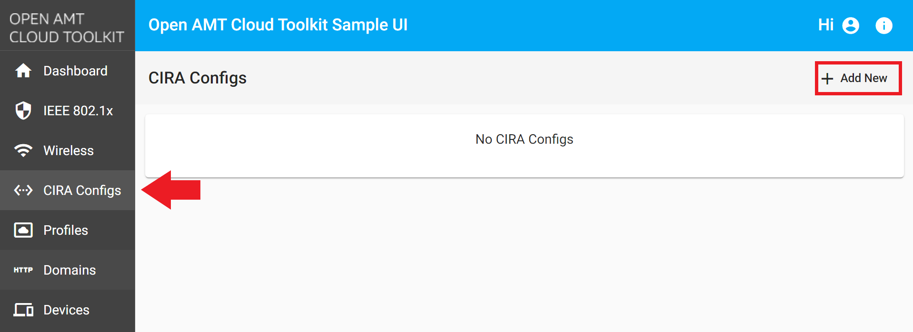

--8<-- "References/abbreviations.md"

Client Initiated Remote Access (CIRA) enables a CIRA-capable edge device to initiate and establish a persistent connection to the MPS. As long as the managed device is connected to the network and to a power source, it can maintain a persistent connection.

!!! note "Note - Wireless Activations"
    This express setup assumes the managed device (i.e. AMT device) is on a wired connection for quickest setup.  To learn more about a Wireless Setup, see the [Wireless Activation Tutorial](./createWiFiConfig.md).

**To create a CIRA Config:**

1. Select the **CIRA Configs** tab from the left-hand menu.

2. In the top-right corner, click **Add New.**
    
    **Figure 1: Create a new CIRA Config.**

3. Specify a **Config Name** of your choice.

4. Select **IPv4**, and provide your development system's IP Address.

5. **Cert Common Name (CN=)** should auto-populate. If not, provide your development system's IP Address.

6. Leave **Port** as the default, 4433.

7. Leave the **Username** as *admin* or choose your own. These credentials will be used when constructing API calls.

8. Leave the slider set on **Auto-load**.

9. Click **Save.**
    
    !!! example "Example CIRA Config"
            
        
        
        **Figure 2: Example CIRA Config.** 

## Next up

Profiles provide configuration information to the AMT Firmware during the activation process with the Remote Provisioning Client (RPC). Profiles also distinguish between activating in: 

**[Client Control Mode (CCM):](createProfileCCM.md)** This mode offers nearly all manageability features including, but not limited to, power control, audit logs, and hardware info. **While Intel® AMT includes redirection features such as KVM while using user consent in CCM**

[Create a CCM Profile](createProfileCCM.md){: .md-button .md-button--primary }

**[Admin Control Mode (ACM):](createProfileACM.md)** ACM mode supports all manageability features **without requiring user consent**. This means it is **not necessary** to have a person on-site to remote in and manage an edge device. In most IoT use cases, edge devices such as digital signage or kiosks may not be easily accessible or have available employees nearby. ACM mode proves immensely helpful in these scenarios.

[Create an ACM Profile](createProfileACM.md){: .md-button .md-button--primary }