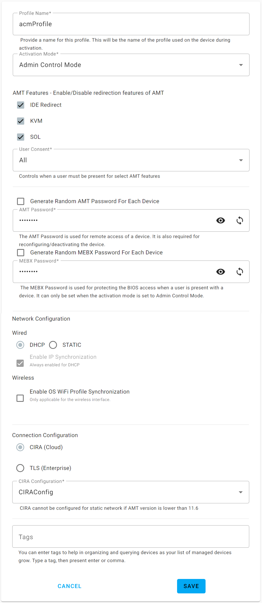
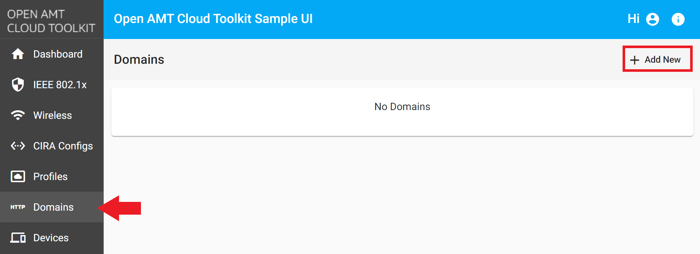

--8<-- "References/abbreviations.md"

Admin Control Mode (ACM) provides full access to Intel® Active Management Technology (Intel® AMT) functionality. User consent is optional for redirection features.


**Figure 1: Set up configuration and profiles for N number of clients. **

### What You'll Need

#### Provisioning Certificate

By purchasing a certificate, you'll be able to remotely activate an Intel AMT device in ACM. This feature enables you to disable User Consent. Provisioning Certificates are available from four different Certificate Authorities:

- [Comodo](https://www.intel.com/content/www/us/en/architecture-and-technology/intel-active-management-technology/how-to-install-comodo-certificates.html)
- [DigiCert](https://www.intel.com/content/www/us/en/support/articles/000055009/technologies.html)
- [Entrust](https://www.intel.com/content/www/us/en/support/articles/000055010/technologies/intel-active-management-technology-intel-amt.html)
- [GoDaddy](https://www.intel.com/content/dam/support/us/en/documents/software/software-applications/how_to_purchase_and_install_godaddy_certificates_for_setup_and_configuration.pdf)

!!! Important
    For ACM in Open Active Management Technology (Open AMT) Cloud Toolkit, **use only** certificate vendors that support Intel® AMT.


#### DNS Suffix
The DNS suffix encompasses the domain suffix (e.g., .com) and follows the hostname. Consider the following DNS Name example:

???+ Example
    DNS Name: cb-vending1.burgerbusiness.com

In this example, the hostname is **cb-vending1** and the DNS suffix is **burgerbusiness.com.**

 **To set the DNS suffix: **

1. Manually set it using MEBX on the managed device. Find instructions [here](../Topics/MEBX/dnsSuffix.md)

2. Alternately, change the DHCP Option 15 to DNS Suffix within the Router settings.

**To find the the DNS suffix, use the following command: **

=== "Linux"
    ``` bash
    ifconfig
    ```

=== "Windows"
    ```
    ipconfig /all
    ```

<br>

### Create a Profile

[Profiles](../Glossary.md#p) provide configuration information to the AMT Firmware during the activation process with the Remote Provisioning Client (RPC).

!!! note "Production Environment"
        In a production environment, devices are typically activated in ACM mode. ACM mode enables KVM access to devices without user consent. In most IoT use cases, edge devices such as digital signage or kiosks may not have immediate access to it or employees nearby. ACM mode proves immensely helpful in these scenarios.


**To create an ACM profile:**

1. Select the **Profiles** tab from the menu on the left.

2. Under the **Profiles** tab, click **Add New** in the top-right corner to create a profile.

    [](../assets/images/RPS_NewProfile.png)
    **Figure 1: Create a new profile.**

3. Specify a **Profile Name** of your choice.

4. Under **Activation**, select **Admin Control Mode** from the dropdown menu.

5. In order to facilitate quick set up,  leave **Generate Random AMT Password** unchecked. 
   
    !!! tip "Production Environment"
        In a production environment, generate a random password for each AMT device to create a stronger, more secure AMT environment. However, if opting to use random    passwords, be aware of the risks. **If the Vault database is lost or corrupted, all randomly generated credentials will be lost.** There will be no way to login. The administrator will have to clear the CMOS battery on the managed devices!

6. Provide a strong **AMT Password**. AMT will verify this password when receiving a command from a MPS server.

    !!! important
        This password must meet standard, **strong** password requirements:

        - 8 to 32 characters

        - One uppercase, one lowercase, one numerical digit, one special character

7. Leave **Generate Random MEBX Password** unchecked.
   
8. Provide a strong **MEBX Password**. This password can be used to access Intel® Manageability Engine BIOS Extensions (Intel® MEBX) on the AMT device.

9. Select DHCP as **Network Configuration**.

10. Select the name of the **CIRA Configuration** you created previously from the drop-down menu.

11. Optionally, add **Tags** to help in organizing and querying devices as your list of managed devices grow.

12. Click **Save.**

!!! example
    Example ACM Profile:
    [](../assets/images/RPS_CreateProfile_ACM.png)

    **Figure 2: Example ACM profile.**

### Create a Domain Profile

In addition to a CIRA Config and an ACM Profile, ACM requires the creation of a Domain profile.

Intel AMT checks the network DNS suffix against the provisioning certificate as a security check. During provisioning, the trusted certificate chain is injected into the AMT firmware.  AMT verifies that the certificate chain is complete and is signed by a trusted certificate authority.

**To create a domain:**

1. Select the **Domains** tab from the left-hand menu.

2. In the top-right corner, click **Add New.**

    [](../assets/images/RPS_NewDomain.png)

    **Figure 3: Create Domain. **

3. Specify a name of your choice for the Domain Profile for the **Domain Name** field. This does not have to be the actual network Domain Name/Suffix.

4. Provide your **Domain Suffix**. This is the actual DNS Suffix of the network domain that is set in DHCP Option 15 or manually on the AMT device through MEBX.

5. Click **Choose File** and select your purchased Provisioning Certificate.  This certificate must contain the private key.

6. Provide the **Provisioning Certificate Password** used to encrypt the `.pfx` file.

7. Click **Save.**

    !!! example
        Example Domain:
            
        [](../assets/images/RPS_CreateDomain.png)
        **Figure 4: Example Domain profile. **


## Next Up

**[Build & Run RPC](../General/buildRPC.md)**


