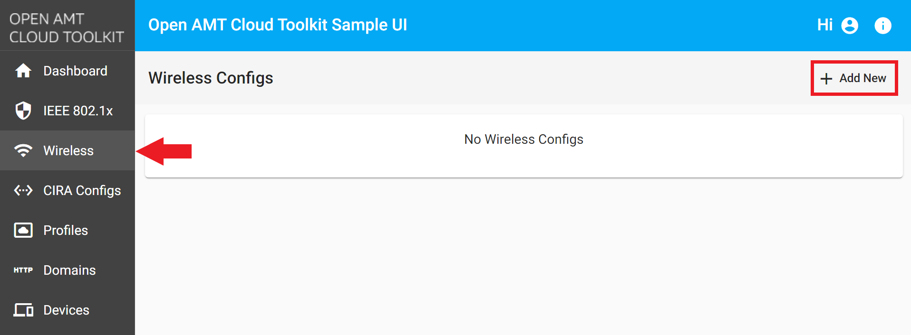
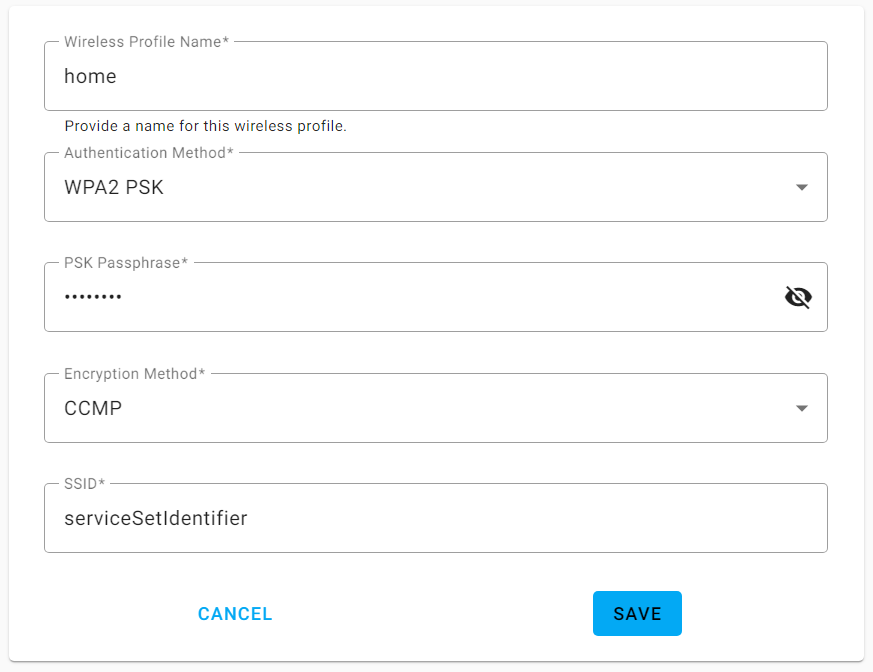

--8<-- "References/abbreviations.md"

**To create a WiFi Config:**

1. Select the **Wireless** tab from the left-hand menu.

2. In the top-right corner, click **Add New.**
    
    **Figure 1: Create a new WiFi Config.**

3. Specify a **Profile Name** of your choice.

4. Under **Authentication Method**, select **WPA PSK** or **WPA2 PSK**.

5. Under **Encryption Method**, select **TKIP** or **CCMP** 

6. Specify a **SSID** or in common terms, name of your wireless network.

7. Provide a strong **PSK Passphrase**. This passphrase is the password to the WiFi Network.

8. Click **Save.**
    
    !!! example
        Example WiFi Config:
        
        **Figure 2: Example WiFi Config.** 

## Next up

Profiles provide configuration information to the AMT Firmware during the activation process with the Remote Provisioning Client (RPC). Profiles also distinguish between activating in: 

**[Client Control Mode (CCM):](createProfileCCM.md)** This mode offers nearly all manageability features including, but not limited to, power control, audit logs, and hardware info. **While Intel® AMT includes redirection features such as KVM while using user consent in CCM, the Open AMT Cloud Toolkit does not currently support doing so.**

**[Admin Control Mode (ACM):](createProfileACM.md)** ACM mode supports all manageability features **without requiring user consent**. This means it is **not necessary** to have a person on-site to remote in and manage an edge device. In most IoT use cases, edge devices such as digital signage or kiosks may not be easily accessible or have available employees nearby. ACM mode proves immensely helpful in these scenarios.