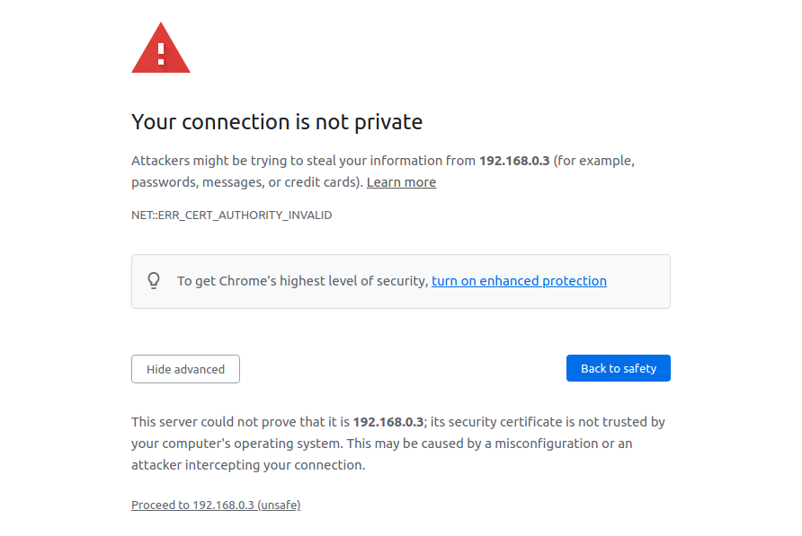

--8<-- "References/abbreviations.md"

The web portal is available for login after the deployment of the MPS, RPS, and Sample Web UI. Make sure all three are successfully running before attempting to login.

## Before Logging In

!!! Important
    Do not skip these steps. It enables the Sample Web UI to connect to the MPS server.

1. Open any modern web browser and navigate to the following link. Because the MPS Server is using self-signed certificates in developer mode, we must proceed past the warning screen for the Sample Web UI to connect.

    ```
    https://[Development-IP-Address]:3000
    ```

2.  A warning screen will prompt. Click **Advanced** and then **Proceed** to continue to connect to the MPS webserver.

    !!! example
        [](../assets/images/selfSignedConnect.png)

3. After clicking proceed, you will see the following text. **This is OK. Move on to the next section: Log In.**

    ```
    Cannot GET /
    ```

## Log In

1. Open a new tab in your browser and navigate to the Sample Web UI using localhost.

    ```
    http://localhost:4200
    ```

    !!! important
        The Sample Web UI uses **HTTP** and not **HTTPS**.


2. Log in to the web portal with the credentials below.

    **Default credentials:**

    | Field       |  Value    |
    | :-----------| :-------------- |
    | **Username**| standalone |
    | **Password**| G@ppm0ym |

3. The home page should look like the following.

    [](../assets/images/WebUI_Home.png)

    **Figure 1: Sample Web UI Home Page**

## Next up
**[Create a CIRA Config](createCIRAConfig.md)**
