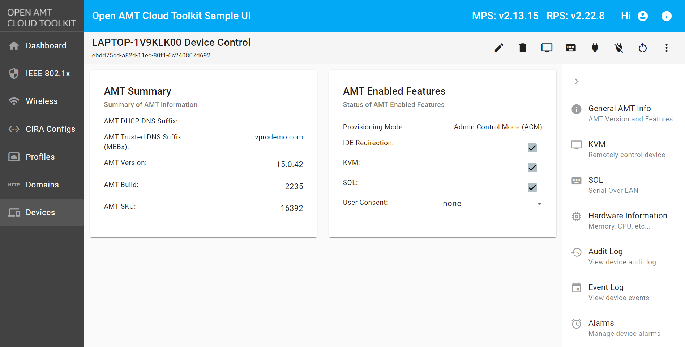
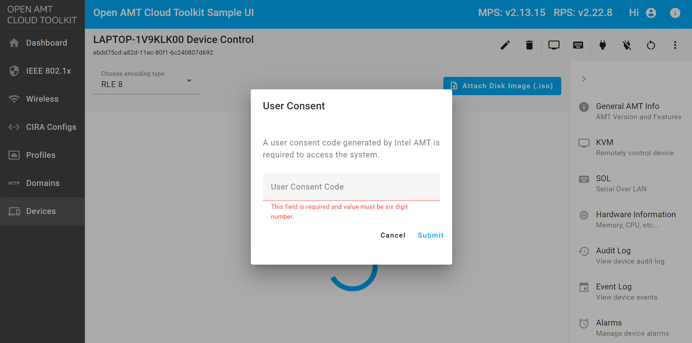

--8<-- "References/abbreviations.md"

1. Go back to the Sample Web UI on your development system.
	
2. Click the Devices tab from the menu on the left.

    

    !!! troubleshooting
        If the activated device is not listed or if it is listed as unconnected, try restarting the AMT device. After successfully restarting the device, refresh the Sample Web UI to see if the *Status* changes to *connected*.

3. Click on your connected device.

4. Select an action to perform from the options in the top-right.

    

    !!! note
        If activated into Client Control Mode(CCM), the KVM and SOL features will require a user consent code to be entered that will be displayed on the device. To use KVM/SOL without user consent, follow the [ACM Activation Tutorial](createProfileACM.md) for how to configure a device into Admin Control Mode.

    !!! note
        Activated already? Try out the Keyboard, Video, Mouse (KVM) feature to remotely view and control the AMT device.  Issue a Reset to BIOS command and be able to view and make live changes to BIOS settings.

5. When performing a KVM action, give the user consent code displayed on the client device.
    
    
  
 

## Next steps

After successfully deploying the Open AMT Cloud Toolkit microservices and client, explore other tools and topics in the Open AMT Cloud Toolkit architecture:

### REST API Calls
Use the REST API tutorial to construct an Authorize API call to get a JWT Token as well as a Devices API call to see connected devices using node.js. Then, modify the template to create other MPS REST API calls. 

[Get Started with REST API Calls](../Tutorials/apiTutorial.md){: .md-button .md-button--primary }

### UI Toolkit
Explore the Open AMT Cloud Toolkit reference implementation console by adding manageability features with prebuilt React components, such as Keyboard, Video, and Mouse (KVM).

[Get Started with the UI Toolkit](../Tutorials/uitoolkit.md){: .md-button .md-button--primary }

### Security
Learn how to use the Open AMT Cloud Toolkit architecture to secure assets. Topics include credentials, allowlisting, best known security methods, and more.

[Learn More about Security and Hardening](../Microservices/MPS/securityMPS.md){: .md-button .md-button--primary }

