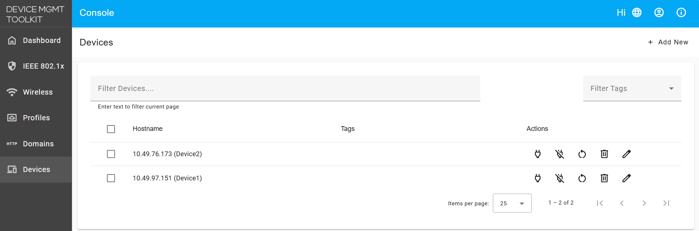
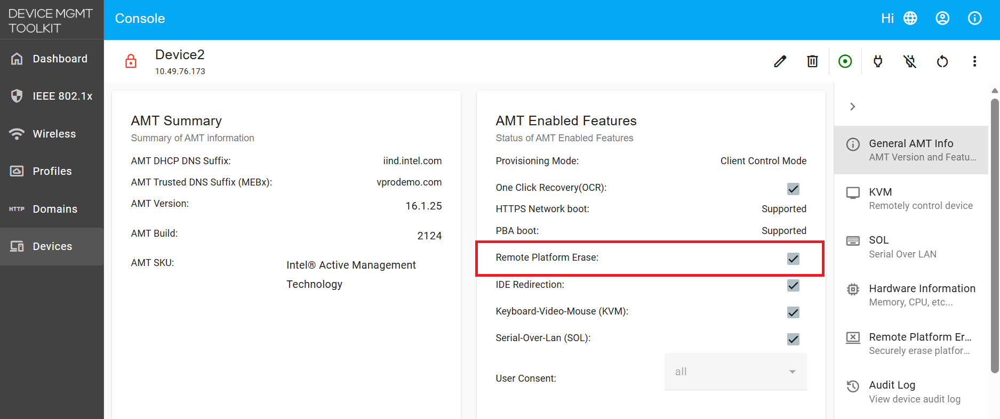
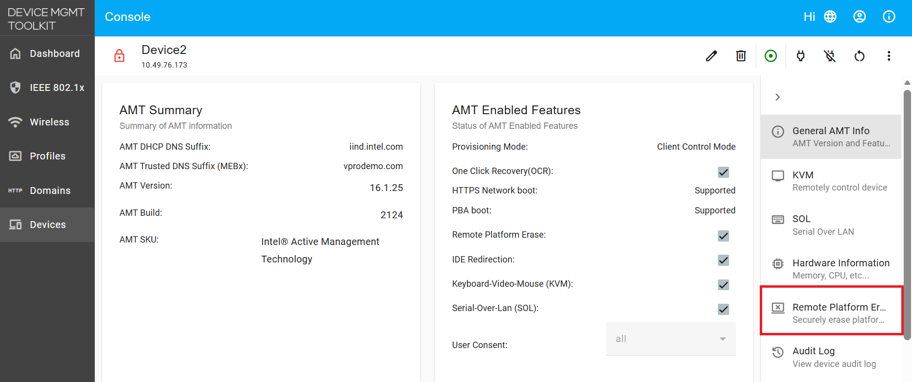
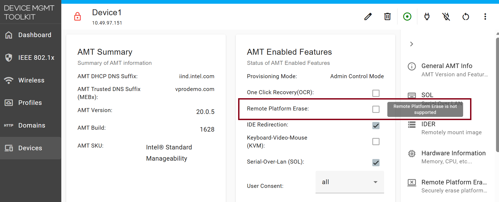
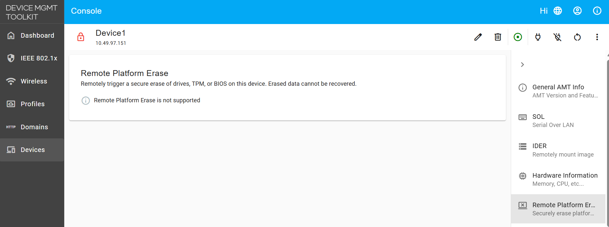
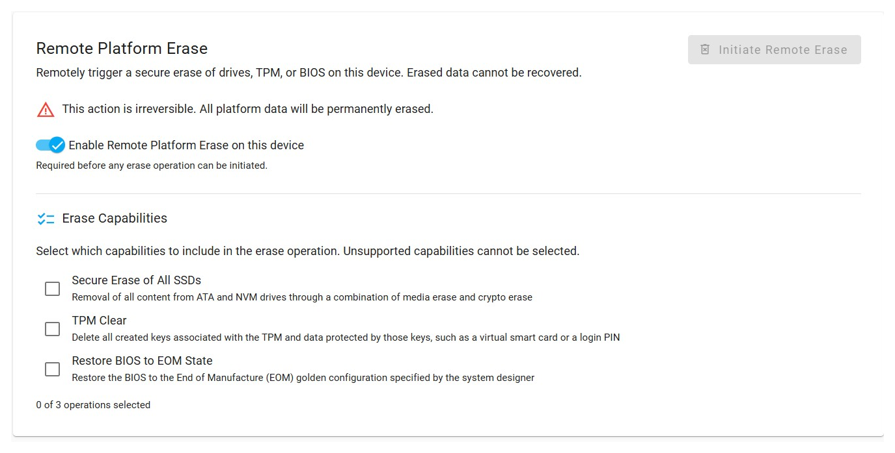
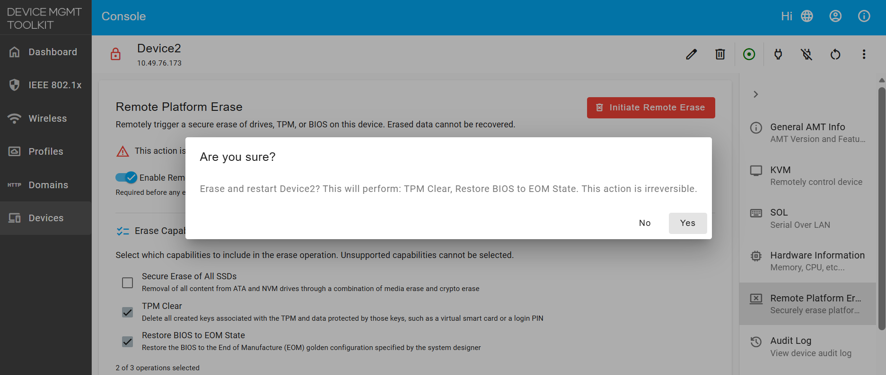

Intel® Remote Platform Erase (RPE) allows IT administrators to remotely wipe a supported Intel vPro® system and restore it to a known manufacturer baseline (its "golden state") using Intel AMT's out-of-band (OOB) connection. It is used when decommissioning systems, preparing devices for reuse, or recovering a machine from a compromised state.

## Supported Erase Options

Console exposes three erase actions, which can be selected individually or together:

- **Secure Erase of All SSDs**: Removes all content from ATA and NVM drives through a combination of media erase and crypto erase.

- **TPM Clear**: Deletes all keys created in the Trusted Platform Module (TPM) and any data protected by those keys, such as a virtual smart card or a login PIN.

- **Restore BIOS to EOM State**: Restores the BIOS to the End of Manufacture (EOM) golden configuration specified by the system designer.

!!! info "A fourth capability is not shown in the UI"

    Intel Remote Platform Erase defines a fourth capability, **Unconfigure Intel CSME Firmware**, which fully unprovisions Intel AMT and returns it to its default state, disabling Intel AMT features. Console's REST API accepts it as `unconfigureCSME`, but the Sample Web UI does not currently display it. A device unconfigured this way is removed from Console and cannot be managed remotely until it is reprovisioned.

!!! danger "This Operation Is Irreversible"

    RPE permanently destroys data on the target system. Erased drives, cleared TPM keys, and overwritten BIOS settings cannot be recovered. Confirm you have selected the correct device before initiating an erase.

## Where to Start

- To confirm the device can run RPE and exposes the feature, start with [Verify and Enable RPE Support](#verify-and-enable-rpe-support).
- To run an erase on a device that is already enabled, go to [Triggering a Remote Platform Erase](#triggering-a-remote-platform-erase).

## Prerequisites

Before using RPE, ensure the target system meets the following requirements:

1. The device must be running **Intel CSME 16.0 or later**, as documented in the [Intel® AMT SDK](https://software.intel.com/sites/manageability/AMT_Implementation_and_Reference_Guide/WordDocuments/Secure_Remote_Platform_Erase.htm). Intel CSME 16.0 erases ordinary SSDs; Raptor Lake platforms on **Intel CSME 16.1 and later** also erase Pyrite self-encrypting drives.

2. Console must be **connected to the device over TLS**.

3. Both the **BIOS and firmware** must support Remote Platform Erase. Support is reported per capability: Console reads which erase actions the platform allows and disables the rest, so the options offered on one device may differ from another.

4. Remote Platform Erase must be **enabled in the target system's BIOS**. Intel requires the feature to be enabled in two places — in the BIOS and in Intel AMT — and Console can only set the Intel AMT half. Supporting the feature and having it switched on are two different things.

    !!! warning "Enable RPE in BIOS before you start"

        Intel states that the BIOS setting can be changed **only via the BIOS menu**, on the target machine itself. Intel AMT reports it as a read-only value, so no Console setting will turn it on. Reach the BIOS menu over a KVM session or at the machine. If the feature is left disabled there, the erase fails with *Remote Platform Erase is not enabled by the BIOS on this device*, whatever the device's Console settings say. Where a platform's BIOS does not support Remote Platform Erase at all, the option will not be present in the menu.

5. Remote Platform Erase is available regardless of activation mode, including devices activated in **Client Control Mode (CCM)** and **Admin Control Mode (ACM)**.

## Verify and Enable RPE Support

1. Open Console and navigate to the **Devices** tab on the left-hand menu, then select your target device.

    <figure class="figure-image">
      
    </figure>

2. In the **General AMT Info** section, check the **AMT Enabled Features** panel and confirm **Remote Platform Erase** is listed.

    !!! note "Remote Platform Erase availability"

        Confirm the **Remote Platform Erase** checkbox is available and not greyed out, as shown in the snapshot below. A greyed-out checkbox means the platform does not support the feature.

    <figure class="figure-image">
      
    </figure>

3. Select the **Remote Platform Erase** tab in the device navigation on the right.

    <figure class="figure-image">
      
    </figure>

4. Make sure **Enable Remote Platform Erase on this device** is switched on. This is the same setting as the **Remote Platform Erase** checkbox on the **AMT Enabled Features** panel, so it is already on if you enabled it there. The erase options below it stay inactive until it is on.

!!! warning "Remote Platform Erase on Intel® Standard Manageability (ISM) devices"

    On Intel® Standard Manageability (ISM) devices, Remote Platform Erase is not supported. The **Remote Platform Erase** checkbox appears disabled with the tooltip *Remote Platform Erase is not supported*, and the **Remote Platform Erase** tab displays the same message. This limitation is determined by the device's firmware.

    <figure class="figure-image">
      
    </figure>

    <figure class="figure-image">
      
    </figure>

## Triggering a Remote Platform Erase

1. Select the erase capabilities to run. Any combination of the supported options can be selected:

    - **Secure Erase of All SSDs**
    - **TPM Clear**
    - **Restore BIOS to EOM State**

    <figure class="figure-image">
      
    </figure>

    !!! note "Important Notes on Erase operations"

        * Secure Erase of All SSDs removes the OS and requires it to be reinstalled.

    !!! warning "Encrypted drives need a drive password - not yet validated"

        When you select **Secure Erase of All SSDs**, a checkbox labelled **SSD requires disk encryption key** appears below it. Tick it if the drive is self-encrypting, and a **Drive Password** field appears. Console passes that password to Intel AMT as the drive password for the erase operation. Leave both controls alone for drives that are not encrypted.

        **Erasing an encrypted drive has not been tested end to end yet.** The controls above are present in Console, but the full flow has not been validated. This section will be updated with detailed steps once it has.

2. Optionally, start a **KVM session** if you want to observe the reboot and erase process.

3. Click **Initiate Remote Erase** in the top right.

    !!! note "CCM devices prompt for a user consent code"

        Devices activated in Client Control Mode (CCM) default to requiring consent for all features, so Console prompts for a 6-digit **User Consent Code** before the confirmation dialog appears. Enter the code shown on the target device's local display, then continue. Devices with **User Consent** set to **None**, as ACM profiles typically are, skip this step.

4. Review the confirmation dialog, which describes exactly which actions will run, and click **YES** to confirm.

    !!! warning "Point of No Return"

        Clicking **YES** immediately restarts the device and applies the selected erase actions. There is no cancel or undo once the operation begins.

    <figure class="figure-image">
      
    </figure>

5. The device restarts automatically and performs the selected erase and restore actions during boot.

## Additional Resources

The behaviour described on this page is defined by the Intel® AMT SDK. These are the specific pages it draws on:

- *[Intel® Remote Platform Erase](https://software.intel.com/sites/manageability/AMT_Implementation_and_Reference_Guide/WordDocuments/Secure_Remote_Platform_Erase.htm)* – The feature overview: the four erase capabilities and their definitions, the Intel CSME 16.0 minimum, the requirement to run over TLS, and the rule that the feature must be enabled in both the BIOS and Intel AMT.
- *[AMT_BootCapabilities](https://software.intel.com/sites/manageability/AMT_Implementation_and_Reference_Guide/HTMLDocuments/WS-Management_Class_Reference/AMT_BootCapabilities.htm)* – The `PlatformErase` bitmask, which defines each erase capability separately and states the firmware versions individual capabilities require.
- *[AMT_BootSettingData](https://software.intel.com/sites/manageability/AMT_Implementation_and_Reference_Guide/HTMLDocuments/WS-Management_Class_Reference/AMT_BootSettingData.htm)* – The `RPEEnabled` flag that reports the BIOS setting, plus the `PlatformErase` and `RSEPassword` fields used to request an erase.

## Triggering Remote Platform Erase via Console APIs

You can use the Console REST APIs to trigger remote platform erase programmatically. This section describes the API endpoints, authentication, and step-by-step examples.

### API Reference

| Endpoint | Method | Description | Request Body |
|:---|:---|:---|:---|
| `/api/v1/amt/boot/remoteErase/<GUID>` | GET | Retrieve supported erase capabilities for a device | N/A |
| `/api/v1/amt/boot/remoteErase/<GUID>` | POST | Trigger remote platform erase | `{"secureEraseAllSSDs":true,"tpmClear":true,"restoreBIOSToEOM":true,"unconfigureCSME":false,"ssdPassword":""}` |

### Step-by-Step API Flow

1. **Authenticate and Get Login Token**

    First, authenticate with Console and retrieve a JWT token to use for all subsequent API calls:

    ```bash
    curl --insecure -X POST https://<IP_ADDRESS_OR_FQDN_OF_SERVER>/api/v1/authorize -H "Content-Type:application/json" -d "{\"username\":\"<CONSOLE_USERNAME>\",\"password\":\"<CONSOLE_PASSWORD>\"}"
    ```

    Example Response:

    ```json
    {"token":"<YOUR_JWT_TOKEN>"}
    ```

    Save this token to use in the `Authorization` header for the next steps.

2. **Retrieve Connected Devices**

    Fetch the list of connected devices to identify the target device's GUID:

    ```bash
    curl --insecure https://<IP_ADDRESS_OR_FQDN_OF_SERVER>/api/v1/devices -H "Authorization: Bearer <YOUR_JWT_TOKEN>"
    ```

    Example Response:

    ```json
    [
      {
        "guid": "5d52da54-199c-cc3c-3e96-88aedd668dff",
        "hostname": "Device2",
      }
    ]
    ```

    **Next Steps**: Select the GUID of your target device (e.g., `5d52da54-199c-cc3c-3e96-88aedd668dff`) for use in subsequent steps.

3. **Check RPE Support and Available Capabilities**

    Verify that the target device supports remote platform erase and determine which erase capabilities are available:

    ```bash
    curl --insecure https://<IP_ADDRESS_OR_FQDN_OF_SERVER>/api/v1/amt/boot/remoteErase/<DEVICE_GUID> -H "Authorization: Bearer <YOUR_JWT_TOKEN>"
    ```

    Example Response:

    ```json
    {
      "secureEraseAllSSDs": true,
      "tpmClear": true,
      "restoreBIOSToEOM": true,
      "unconfigureCSME": false
    }
    ```

    If all capabilities return `false`, the device does not support remote platform erase. This commonly occurs on devices using Intel® Standard Manageability (ISM), which do not have AMT remote erase capabilities.

4. **Trigger Remote Platform Erase**

    Send the erase request with your selected capabilities. At least one capability must be set to `true`:

    ```bash
    curl --insecure -X POST https://<IP_ADDRESS_OR_FQDN_OF_SERVER>/api/v1/amt/boot/remoteErase/<DEVICE_GUID> -H "Content-Type:application/json" -H "Authorization: Bearer <YOUR_JWT_TOKEN>" -d "{\"secureEraseAllSSDs\":true,\"tpmClear\":true,\"restoreBIOSToEOM\":true,\"unconfigureCSME\":false,\"ssdPassword\":\"\"}"
    ```

    **Request Payload Fields**:
    - `secureEraseAllSSDs` (boolean): Securely erase all SSDs via media and crypto erase
    - `tpmClear` (boolean): Delete all TPM keys and data
    - `restoreBIOSToEOM` (boolean): Restore BIOS to manufacturer defaults (End of Manufacture golden state)
    - `unconfigureCSME` (boolean): Fully unprovision Intel CSME firmware and AMT (removes device from Console)
    - `ssdPassword` (string, optional): Drive password for encrypted SSDs (leave empty for unencrypted drives)

    Expected Response (on success):

    ```json
    {"status":"success"}
    ```

    !!! warning "Encrypted SSDs and drive passwords"

        If you have self-encrypting SSDs and `secureEraseAllSSDs` is set to `true`, provide the drive password in the `ssdPassword` field. Encrypted erase has not been fully tested end to end. Leave this field empty for unencrypted drives.

    !!! note "CCM devices and user consent"

        On Client Control Mode (CCM) devices, the API will prompt for a 6-digit user consent code from the device's local display before proceeding. Provide this code when prompted.

### Error Handling

| HTTP Status | Error | Cause | Solution |
|:---|:---|:---|:---|
| 400 | Bad Request | No erase capability selected or invalid request payload | Select at least one capability: `secureEraseAllSSDs`, `tpmClear`, `restoreBIOSToEOM`, or `unconfigureCSME` |
| 401 | Unauthorized | Invalid or expired JWT token | Re-authenticate and obtain a new token |
| 404 | Not Found | Device GUID does not exist or device is not connected | Verify the GUID from the devices list and confirm the device is online |
| 500 | Internal Server Error | RPE is not enabled in BIOS, or device connection was lost | Enable RPE in device BIOS and ensure device is online |

## Triggering Remote Platform Erase via MPS Cloud Deployment APIs

For cloud deployments using the Management Presence Server (MPS), you can trigger remote platform erase through the MPS REST APIs.

### API Reference

| Endpoint | Method | Description | Request Body |
|:---|:---|:---|:---|
| `/mps/api/v1/amt/boot/remoteErase/<GUID>` | GET | Retrieve supported erase capabilities for a device | N/A |
| `/mps/api/v1/amt/boot/remoteErase/<GUID>` | POST | Trigger remote platform erase | `{"secureEraseAllSSDs":true,"tpmClear":true,"restoreBIOSToEOM":true,"unconfigureCSME":false,"ssdPassword":""}` |

### Step-by-Step API Flow

1. **Authenticate and Get Login Token**

    First, authenticate with MPS and retrieve a JWT token to use for all subsequent API calls:

    ```bash
    curl --insecure -X POST https://<IP_ADDRESS_OR_FQDN_OF_SERVER>/mps/login/api/v1/authorize -H "Content-Type:application/json" -d "{\"username\":\"<MPS_WEB_ADMIN_USER>\",\"password\":\"<MPS_WEB_ADMIN_PASSWORD>\"}"
    ```

    Example Response:

    ```json
    {"token":"<YOUR_JWT_TOKEN>"}
    ```

    Save this token to use in the `Authorization` header for the next steps.

2. **Retrieve Connected Devices**

    Fetch the list of devices connected to MPS to identify the target device's GUID:

    ```bash
    curl --insecure https://<IP_ADDRESS_OR_FQDN_OF_SERVER>/mps/api/v1/devices -H "Authorization: Bearer <YOUR_JWT_TOKEN>"
    ```

    Example Response:

    ```json
    [
      {
        "guid": "5d52da54-199c-cc3c-3e96-88aedd668dff",
        "hostname": "DEVICE-NAME",
        "tags": ["production"],
        "mpsInstance": "http://mps:3000"
      }
    ]
    ```

    **Next Steps**: Select the GUID of your target device (e.g., `5d52da54-199c-cc3c-3e96-88aedd668dff`) for use in subsequent steps.

3. **Check RPE Support and Available Capabilities**

    Verify that the target device supports remote platform erase and determine which erase capabilities are available:

    ```bash
    curl --insecure https://<IP_ADDRESS_OR_FQDN_OF_SERVER>/mps/api/v1/amt/boot/remoteErase/<DEVICE_GUID> -H "Authorization: Bearer <YOUR_JWT_TOKEN>"
    ```

    Example Response:

    ```json
    {
      "secureEraseAllSSDs": true,
      "tpmClear": true,
      "restoreBIOSToEOM": true,
      "unconfigureCSME": false
    }
    ```

    If all capabilities return `false`, the device does not support remote platform erase. This commonly occurs on devices using Intel® Standard Manageability (ISM), which do not have AMT remote erase capabilities.

4. **Trigger Remote Platform Erase**

    Send the erase request with your selected capabilities. At least one capability must be set to `true`:

    ```bash
    curl --insecure -X POST https://<IP_ADDRESS_OR_FQDN_OF_SERVER>/mps/api/v1/amt/boot/remoteErase/<DEVICE_GUID> -H "Content-Type:application/json" -H "Authorization: Bearer <YOUR_JWT_TOKEN>" -d "{\"secureEraseAllSSDs\":true,\"tpmClear\":true,\"restoreBIOSToEOM\":true,\"unconfigureCSME\":false,\"ssdPassword\":\"\"}"
    ```

    **Request Payload Fields**:
    - `secureEraseAllSSDs` (boolean): Securely erase all SSDs via media and crypto erase
    - `tpmClear` (boolean): Delete all TPM keys and data
    - `restoreBIOSToEOM` (boolean): Restore BIOS to manufacturer defaults (End of Manufacture golden state)
    - `unconfigureCSME` (boolean): Fully unprovision Intel CSME firmware and AMT (removes device from MPS)
    - `ssdPassword` (string, optional): Drive password for encrypted SSDs (leave empty for unencrypted drives)

    Expected Response (on success):

    ```json
    {"status":"success"}
    ```

    !!! warning "Encrypted SSDs and drive passwords"

        If you have self-encrypting SSDs and `secureEraseAllSSDs` is set to `true`, provide the drive password in the `ssdPassword` field. Encrypted erase has not been fully tested end to end. Leave this field empty for unencrypted drives.

    !!! note "CCM devices and user consent"

        On Client Control Mode (CCM) devices, the API will prompt for a 6-digit user consent code from the device's local display before proceeding. Provide this code when prompted.

## Error Handling

The following error responses apply to both Console and MPS API endpoints:

| HTTP Status | Error | Cause | Solution |
|:---|:---|:---|:---|
| 400 | Bad Request | No erase capability selected or invalid request payload | Select at least one capability: `secureEraseAllSSDs`, `tpmClear`, `restoreBIOSToEOM`, or `unconfigureCSME` |
| 401 | Unauthorized | Invalid or expired JWT token | Re-authenticate and obtain a new token |
| 404 | Not Found | Device GUID does not exist or device is not connected | Verify the GUID from the devices list and confirm the device is online |
| 500 | Internal Server Error | RPE is not enabled in BIOS, or device connection was lost | Enable RPE in device BIOS and ensure device is online |

## Troubleshooting

### Remote Platform Erase is not enabled by the BIOS on this device

The BIOS-side setting is off. Console can only enable the Console-side toggle; the BIOS setting must be turned on directly on the target machine. Reach the BIOS menu over KVM or locally, enable Remote Platform Erase, and retry.

### Erase capability checkboxes are greyed out

A disabled erase option indicates the device does not support that particular capability. This is determined by the device's hardware and firmware and cannot be changed from Console.

### SSD password must not exceed 64 bytes

The drive password for an encrypted SSD has a 64-byte limit. Shorten the password and retry.

### Erase fails to initiate, or power status cannot be read

Before initiating an erase, Console queries the device's current power state to determine whether to power on or restart the device. If this communication fails—for example, because the device is offline or the connection was interrupted—the erase cannot proceed. Ensure the device is online and the Console connection is stable, then retry.

### Unconfigure CSME performs a full unprovision... / device disappears from Console

This is expected behavior. Selecting this option fully removes all AMT provisioning from the device, causing it to disappear from Console. The device cannot be remotely managed again until it is reprovisioned. This option is hidden by default in Console; if exposed by another tool, treat it as a separate operation distinct from the hardware erase capabilities.

### Prompted for a user consent code, or the code request fails

Client Control Mode (CCM) devices require a user consent code as a security measure. A 6-digit code appears on the device's local display; enter this code in Console to proceed. If the code request fails or the code is rejected, ensure the device is online and has a working display connected, then retry.

---

If you see any issues, please log them on our [GitHub Issues page](https://github.com/device-management-toolkit/console/issues) or reach out to us on our **Discord channel**.
