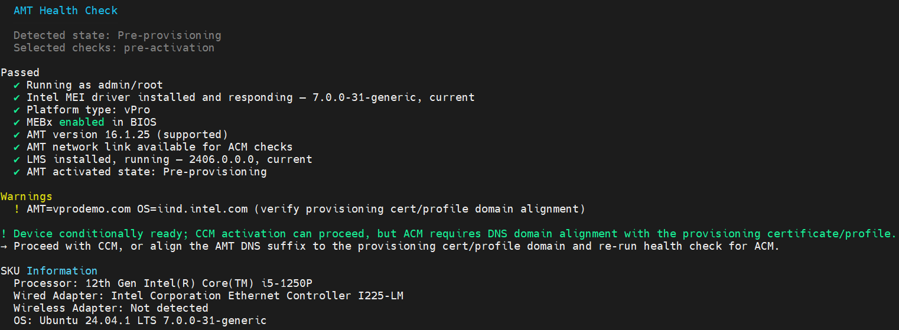
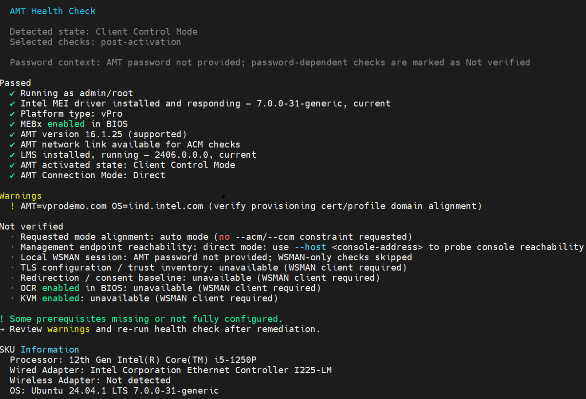
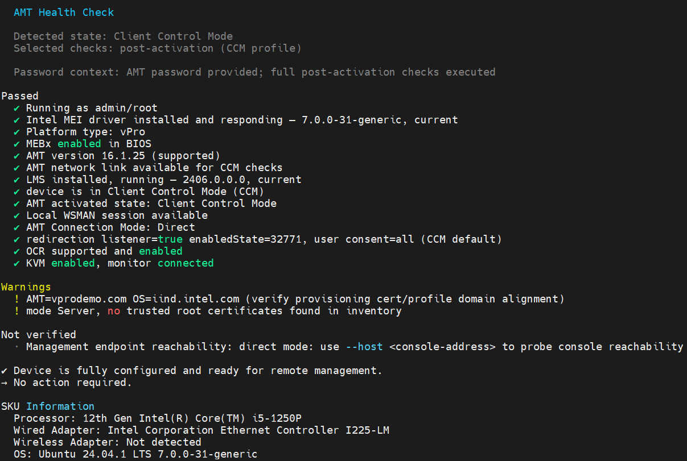

# RPC Health Checker

Use the RPC Health Checker to evaluate an Intel® AMT device before or after activation. It highlights prerequisites, likely blockers, and conditions that could prevent AMT management operations.

Use this quick workflow:

1. Run `rpc status` as an administrator or root user.
2. Add `--acm` or `--ccm` to validate a specific activation mode.
3. Provide `--password` or set `AMT_PASSWORD` for WSMAN-dependent checks on an activated device.
4. Add `--json` when you need a machine-readable result.

## Before you begin

Run RPC with elevated privileges. On Linux, use `sudo`. On Windows, open an Administrator Command Prompt.

This guide is most useful when you need to confirm prerequisites before activation, validate an activated device, or troubleshoot a device that is not ready for normal management.

## Run the health checker

=== "Linux"
    ```bash
    sudo ./rpc status
    ```

=== "Windows"
    ```cmd
    rpc.exe status
    ```

The following command names are equivalent:

=== "Linux"
    ```bash
    sudo ./rpc status
    sudo ./rpc health
    sudo ./rpc doctor
    ```

=== "Windows"
    ```cmd
    rpc.exe status
    rpc.exe health
    rpc.exe doctor
    ```

Use `status` as the primary command name. The other commands are aliases that produce the same result. RPC automatically selects the relevant checks based on the device state:

- **Before activation:** evaluates whether the device is ready to be provisioned.
- **After activation:** evaluates the device's manageability and whether AMT management operations can proceed.

## Select an activation mode

If no activation-mode flag is supplied, RPC performs a general readiness check. To validate a specific activation flow, add only one of the following flags:

| Flag | Purpose |
|------|---------|
| `--acm` | Evaluate Admin Control Mode (ACM) prerequisites. |
| `--ccm` | Evaluate Client Control Mode (CCM) prerequisites. |

Use `--acm` for an admin-managed activation flow and `--ccm` for a client-managed activation flow. If you are unsure which mode applies, start with the default check and then narrow it to the relevant mode.

For ACM-specific checks, DNS suffix and wired-network requirements are blockers. In the default check, those same conditions are reported as warnings because CCM may still proceed.

=== "Linux"
    ```bash
    sudo ./rpc status --acm
    sudo ./rpc status --ccm
    ```

=== "Windows"
    ```cmd
    rpc.exe status --acm
    rpc.exe status --ccm
    ```

## Test management endpoint reachability

Use `--host` to verify that a management endpoint is reachable from the device. If you do not specify a port, RPC uses port `443`. To check a different port, append it to the host name, such as `console.example.com:8443`.

=== "Linux"
    ```bash
    sudo ./rpc status --host console.example.com
    ```

=== "Windows"
    ```cmd
    rpc.exe status --host console.example.com
    ```

This check is optional. An unreachable host does not prevent provisioning, but the report warns that management operations may not work through that endpoint. Use it when a device must reach a specific Console or management service on a known host and port before continuing with provisioning or management operations.

## Post-activation checks and the AMT password

The command does not prompt for an AMT password. For an activated device, provide `--password` when you want RPC to run the additional WSMAN checks that depend on it:

=== "Linux"
    ```bash
    sudo ./rpc status --password '<AMT-password>'
    ```

=== "Windows"
    ```cmd
    rpc.exe status --password "<AMT-password>"
    ```

Without a password, RPC still runs checks that do not require WSMAN. Password-dependent checks are reported as **Not verified**, which indicates that the evaluation is incomplete.

Use a password only for the command you are running. The password is not persisted by the tool; it is only used to establish the local WSMAN session and run the additional checks. For automation or scripting, prefer `AMT_PASSWORD` over embedding the secret directly in the command line.

To avoid writing the password to shell history, use the `AMT_PASSWORD` environment variable when appropriate:

=== "Linux"
    ```bash
    sudo AMT_PASSWORD='<AMT-password>' ./rpc status
    ```

=== "Windows"
    ```cmd
    set AMT_PASSWORD=<AMT-password>
    rpc.exe status
    ```


## Health check results

The text report groups checks into four categories:

| Category | Meaning |
|----------|---------|
| **Passed** | The requirement was satisfied. |
| **Warnings** | The check found a concern that may not prevent the selected operation. |
| **Failed** | The check found a condition that prevents the selected operation. |
| **Not verified** | The check was not applicable or a required component, such as MEI or WSMAN, was unavailable. |

The final summary recommends the next action. In practice, **Passed** means continue, **Warning** means review, **Failed** means block the selected mode, and **Not verified** means rerun the check with the required AMT password or dependency available.

!!! note
    Some checks apply only in specific configurations. For example, CIRA checks apply only when the device uses CIRA, and unsupported features are not treated as failures.

### Example: Pre-Activation Status

Before activation, the report evaluates local prerequisites and will produce output similar to the following:

<figure class="figure-image">
    
    <figcaption>Example pre-activation status for a device ready for activation.</figcaption>
</figure>

Depending on the selected mode, pre-activation checks can include administrator privileges, MEI availability, platform and AMT-version support, BIOS configuration, DNS suffix, wired-network availability, LMS, and optional management-endpoint reachability. Use `--acm` or `--ccm` to evaluate the requirements for one activation mode.

### Example: Activated Device without a password

After activation, RPC verifies the AMT state and management configuration. Without an AMT password, checks that need a local WSMAN session are listed as **Not verified**:

<figure class="figure-image">
    
    <figcaption>Example post-activation status when no AMT password is provided.</figcaption>
</figure>

### Example: Activated Device with a password

With `--password` or `AMT_PASSWORD`, RPC can evaluate WSMAN-dependent checks and report them under **Passed**, **Warnings**, or **Failed**:

<figure class="figure-image">
    
    <figcaption>Example post-activation status when an AMT password is provided.</figcaption>
</figure>

Activated devices can also include control-mode alignment, CIRA configuration and connectivity, remote manageability, One Click Recovery, and management-endpoint reachability checks when applicable.

## JSON output

Use `--json` to print the health check result in JSON format:

=== "Linux"
    ```bash
    sudo ./rpc status --json > health.json
    ```

=== "Windows"
    ```cmd
    rpc.exe status --json > health.json
    ```

The JSON document contains `metadata`, `evaluation`, and `checks` objects. Use this structured output in scripts instead of parsing the text report.

The `evaluation` object includes the detected device state, checks performed, overall result, check counts, and provisioning or manageability result. When a required component is unavailable, it also includes a reason that the evaluation could not be completed.

Each item in `checks` contains a check name, status, and optional message. The JSON status values are `pass`, `warn`, `fail`, `skip`, and `unavailable`. The text report uses the equivalent human-readable labels: **Passed**, **Warning**, **Failed**, and **Not verified**.

Example:

```json
{
  "evaluation": {
    "detectedState": "pre_provisioning",
    "overallResult": "ready",
    "readyToProvision": true
  },
  "checks": [
    {
      "name": "MEI driver",
      "status": "pass",
      "message": "Intel MEI driver installed and responding"
    }
  ]
}
```

## Troubleshooting

### LMS is not running or not installed

The checker tests the local LMS ports and reports whether LMS is missing or not responding. It does not start the service. Install or start LMS, then rerun the check.

### WSMAN checks are not verified

For an activated device, provide the AMT password and rerun the command. RPC uses the local LMS service to establish the WSMAN session. If WSMAN remains unavailable, verify the password, LMS service, and local AMT/WSMAN connection.

### The device is not ready for provisioning

Review the specific blocker in the report. Common causes include missing administrator privileges, MEI or LMS not available, BIOS settings not in the expected state, or DNS or wired-network requirements not met for ACM.

### DNS suffix or wired-link warning

These checks are especially important for ACM. Verify that the AMT DNS suffix is configured, matches the provisioning certificate or profile domain, and that the wired AMT interface is available. CCM may still proceed when the issue is ACM-specific.

### Management endpoint is unreachable

Verify that the host is correct, the port is open, and the endpoint is reachable from the device. If the endpoint is a Console or management service, confirm that the device can reach it over the expected network path. This is usually a networking issue rather than a local AMT issue.

### The check is marked as Not verified

This usually means a required dependency was unavailable. Confirm that the AMT password is supplied for password-dependent checks, make sure the local LMS service is running, and rerun the command. If the dependency is still unavailable, the report indicates that the evaluation is incomplete rather than conclusively passing or failing.

## Related RPC documentation

- [RPC CLI commands and flags](v2/commandsRPC.md)
- [RPC overview](overview.md)
- [Build RPC-Go manually](buildRPC_Manual.md)
- [Transition an activated device](transitionDeviceRPC.md)