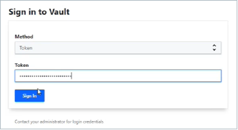
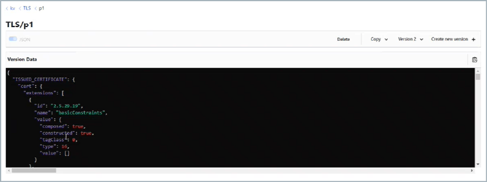

--8<-- "References/abbreviations.md"

During the activation process with the Remote Provisioning Client (RPC), profiles provide configuration information to the firmware on platforms featuring Intel® AMT.

In **Profiles**, the Open AMT Cloud Toolkit supports Client Initiated Remote Access (CIRA) connections, which use Transport Layer Security (TLS). The toolkit also supports TLS without CIRA. TLS connections encrypt Intel® AMT network traffic, increasing data security and privacy.

!!! Important
    * TLS works with both ACM And CCM.
    * Because CIRA connections already use TLS, the option to use both in a profile is not available, as it would double the amount of encryption/decryption and potentially impact performance.

**To create a profile with TLS Config:**

1. Select the **Profiles** tab from the menu on the left.

2. Under the **Profiles** tab, click **+ Add New** in the top-right corner to create a profile.

    
    **Figure 1: Create a new profile.**

3. Specify a **Profile Name** of your choice.

4. Under **Activation Mode** from the dropdown menu.

5. Provide or generate a strong **AMT Password**. AMT will verify this password when receiving a command from a MPS server. This password is also required for device deactivation.

    !!! tip
        The two buttons next to the password input are for toggling visibility and generating a new random password. Please note that **if the Vault database is lost or corrupted, all credentials that aren't also stored somewhere else will be lost.** There will be no way to login. The administrator will have to clear the CMOS battery on the managed devices!
   
6. The **MEBX Password** field is disabled, as the password for Intel® Manageability Engine BIOS Extensions (Intel® MEBX) cannot be set when activating in CCM due to the lower level of trust when compared to ACM.

7. Leave DHCP as the default for **Network Configuration**.

8. Optionally, add **Tags** to help in organizing and querying devices as your list of managed devices grow.

9. Select **Connection Configuration** to **TLS (Enterprise)**

10. Under **TLS (Enterprise)**, select the **TLS Mode from** the dropdown menu. 
    
    The toolkit offers four configuration modes to support various usage models: 

    | CONFIGURATION MODE           | DESCRIPTION                           |
    | :--------------------------- | :------------------------------------ |
    | Server Authentication Only | The client authenticates the server request and accepts only those servers with a digital certificate. |
    | Server and Non-TLS Authentication | **Used primarily for testing.** The client authenticates the server request and accepts legitimate digital certificates from TLS-enabled servers. However, if the server is not TLS-enabled, the client defaults to a CIRA connection.|
    | Mutual TLS Authentication Only | Both client and server **must** have certs. The client cert is signed by the server cert. |
    | Mutual and Non-TLS Authentication | **Used primarily for testing.** Both client and server certs are expected. The client authenticates the server request and accepts legitimate digital certificates from TLS-enabled servers. However, if the server is not TLS-enabled, the client defaults to a CIRA connection.   |

11. This express setup assumes the managed device (i.e. AMT device) is on a wired connection for quickest setup.  To learn more about a Wireless Setup, see the [Wireless Activation Tutorial](../Tutorials/createWiFiConfig.md).

12. Click **Save.**

    !!! example "Example profile with TLS Config"
        
        
        
        **Figure 2: Example profile with TLS Config.**

13. To confirm the digital certificates generated for the profile, open a browser and navigate to the [Vault service](https://localhost:8200). Use the Vault token stored in the .env file. **Sign in to Vault** on the development system.

    

    **Figure 3: Login with the token**

14. Choose the **Secrets** tab and then navigate to the path: **< kv <TLS < [profile name]**.

    !!! example "Example of Certificate Storage"
        

    **Figure 4: Digital Certificate**

## Next up
**[Build & Run RPC](../GetStarted/buildRPC.md)**

