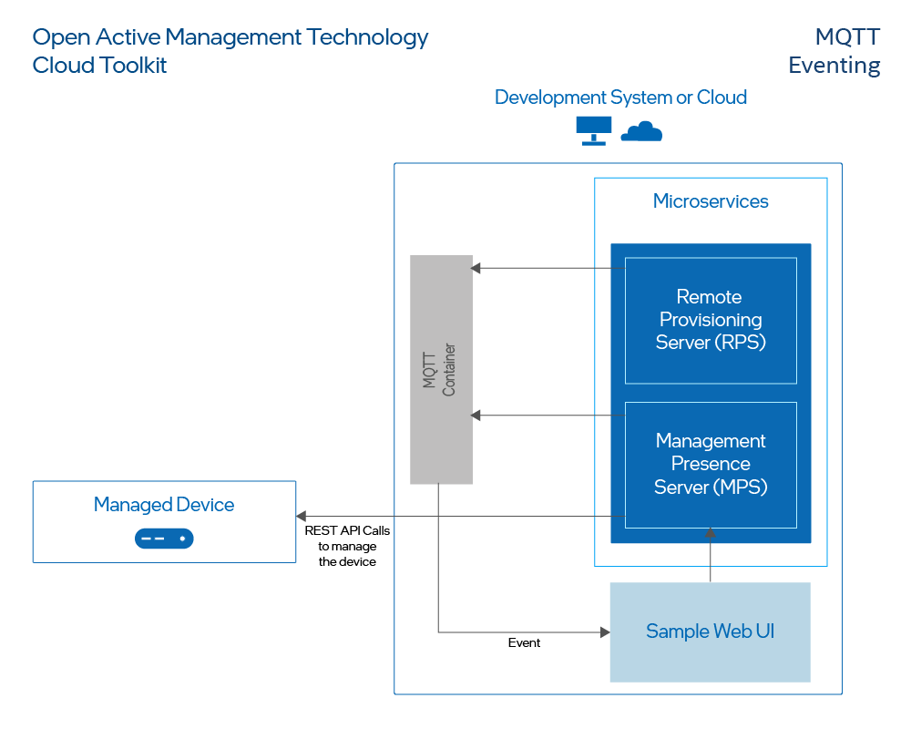

--8<-- "References/abbreviations.md"

# Message Queuing Telemetry Transport (MQTT) Eventing Support

Open AMT Cloud Toolkit supports Eventing, customizable event monitoring, using Message Queuing Telemetry Transport (MQTT), an IoT publish-and-subscribe network protocol. With MQTT Eventing administrators subscribe and customize network event monitoring. This eliminates the need to query or poll MPS to determine network events, such as a device's activation or deactivation. Administrators can subscribe to events and respond proactively. 

!!! important
    Currently, the implementation publishes all REST API call events to the MPS. 

**Figure 1: MQTT Eventing Examples**

An Open AMT Cloud Toolkit sends JSON events to a Mosquitto* broker deployed as a Docker container. Administrators subscribe to the broker. In Figure 1 above, proactive notifications are published on the MQTT bus. 

## What You'll Need

**Obtain MQTT Explorer: **

1. Go to the Microsoft Store.
2. Type `MQQT-Explorer` in **Search**.
3. Choose **Get**.

# To Set Up MQTT Support

**To enable support:**

1. In a text editor or IDE of choice, open the `.env` file to edit.

2. Update the field `MPS_MQTT_ADDRESS` with `mqtt://mosquitto:8883`. The `mqtt:` prefix indicates an MQTT broker is being used. Kong* will now route event messages to port 8083.
   
3. Save and close file.

**Open MQTT Explorer to see the events:**
   
1. Choose **+ Connections** to create a new connection.
   
2. Add a Name (suggested: `MPS`). 
   
3. Choose the `mqtt` from the dropdown **protocol**. 
   
4. In the **Host** field, add the IP address of the system where Kong is installed.
   
5. In the **Port** field, add 8883.
   
6. Choose **Connect.**
    
7. In the Sample Web UI, click on a managed device from **Devices** list to see an event appear in MQTT Explorer.
