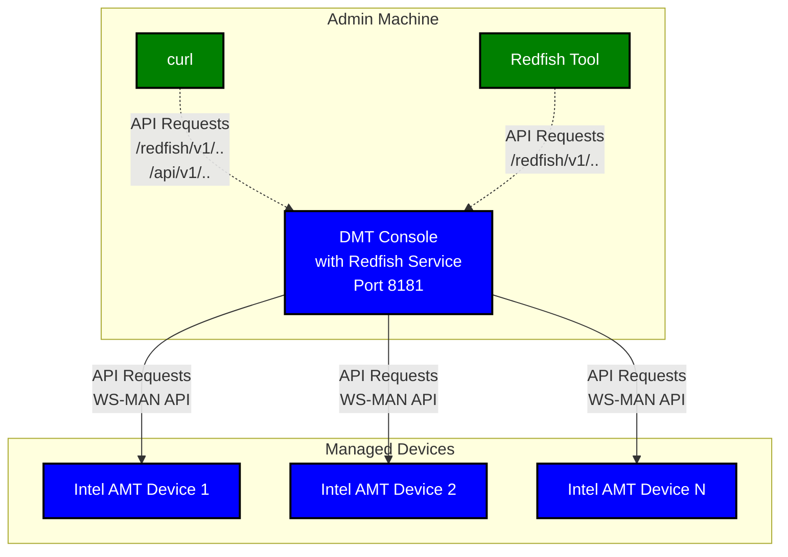

# DMT Console Redfish User Guide

This tutorial demonstrates how to set up, configure, and test the DMT Console Redfish API implementation. The Redfish API is a REST interface that lets you manage Intel AMT-enabled devices through standardized HTTP endpoints.

## What You Will Do

In this tutorial, you will:

- Download and run the DMT Console Release supporting Redfish end points
- Test Redfish endpoints using curl commands or the DMTF Redfish Tool
- Troubleshoot common issues

## Supported Redfish Features

The DMT Console implements the following Redfish API v1.19.0 features for remote power management and fleet management.

**Service Discovery:**

- Service Root (`/redfish/v1/`) - Entry point for the Redfish service
- OData Service Document (`/redfish/v1/odata`) - List of available entity sets
- Metadata Document (`/redfish/v1/$metadata`) - OData CSDL schema definition

**Computer System Management:**

- **Systems Collection** (`/redfish/v1/Systems`) - List all managed Intel AMT devices
- **System Information** (`/redfish/v1/Systems/{id}`) - Retrieve detailed system properties:
- **Power Control Actions** (`/redfish/v1/Systems/{id}/Actions/ComputerSystem.Reset`) - Remote power management via `ComputerSystem.Reset`:

**Standards Compliance:**

- Redfish API v1.19.0
- OData Version 4.0
- DMTF ComputerSystem v1.26.0 schema

## Tutorial Flow

Follow these sections in order:

1. **[Prerequisites](#prerequisites)** - Tools installation
2. **[Download the Pre-built Redfish Binary](#download-the-pre-built-redfish-binary)** - Download and prepare the release package
3. **[Configuring and Executing the DMT Console Application](#configuring-and-executing-the-dmt-console-application)** - Configuration settings and server startup
4. **[Using the Redfish API through DMTF Redfish Tool](#using-the-redfish-api-through-dmtf-redfish-tool)** - API testing with the official DMTF Redfish tool
5. **[Using the Redfish API through curl commands](#using-the-redfish-api-through-curl-commands)** - API testing with curl commands
6. **[Troubleshooting](#troubleshooting)** - Common issues and solutions
7. **[Additional Resources](#additional-resources)** - Documentation and reference links

## Setup Overview

The following diagram shows how the components connect during this tutorial:



**Components:**

- **DMT Console**: Redfish service running on the helpdesk machine
- **curl / Redfish Tool**: Command-line clients for testing and interacting with the Redfish API
- **Intel AMT Devices**: Managed devices with Intel AMT firmware

## Prerequisites

Install the following tools before running this tutorial:

1. **curl** (for API calls) : Comes pre-installed on most of the OS'es, if not available install it from the official website(<https://curl.se/download.html>) or your OS package manager.

2. **DMTF Redfish Tool** (for Redfish CLI testing) : Repository and install guidance: <https://github.com/DMTF/Redfishtool>. The version used in this tutorial is 1.1.8 or later.

## Download and Configure the Pre-built Redfish Binary

Download the pre-built release package from <https://github.com/device-management-toolkit/console/releases>
Use a release that includes the Redfish functionality you want to test, then extract the archive.

After downloading and extracting the Redfish binary, continue with the Enterprise setup guide: [Configuration](../../GetStarted/Enterprise/setup.md#configuration) and follow the instructions to run the Console application and Add Devices. Once the console is running, you can proceed to test the Redfish API using either curl commands or the DMTF Redfish Tool as described in the next sections.

> **Note:** Configure the Console application to run with TLS enabled before testing Redfish endpoints. Redfish access in this guide assumes HTTPS.

### Verifying the Redfish Endpoint

Test that the Redfish Endpoint is running:

> **Note:** On Windows, PowerShell has a built-in `curl` alias for `Invoke-WebRequest`. To use the native curl executable instead, either use `curl.exe` explicitly in commands, or remove the alias by running `Remove-Item Alias:curl` in your PowerShell session.

```bash
# Check if the server is listening (use -k to ignore self-signed certificate, -s for silent mode)
curl -sk https://<console_host_or_ip>:<console_port>/redfish/v1/ | jq

# Reference  response:
{
  "@odata.context": "/redfish/v1/$metadata#ServiceRoot.ServiceRoot",
  "@odata.id": "/redfish/v1",
  "@odata.type": "#ServiceRoot.v1_19_0.ServiceRoot",
  "Id": "RootService",
  "Name": "Root Service",
  "Product": "Device Management Toolkit - Redfish Service",
  "RedfishVersion": "1.19.0",
  "Systems": {
    "@odata.id": "/redfish/v1/Systems"
  },
  "UUID": "ebc6c6c9-1ed3-4f12-ae0b-7b877c55de07",
  "Vendor": "Device Management Toolkit"
}

# Reference log on the Console
{"level":"info","time":"2025-12-06T15:22:40+05:30","caller":"/home/admin/dmt/console-redfish-nm/pkg/logger/adapters.go:29","message":"[GIN] 2025/12/06 - 15:22:40 | 200 |     795.431µs |   10.190.213.16 | GET      \"/redfish/v1/\""}
```

> Note: If you receive connection errors or no response check for any proxy settings on your machine that may be interfering with local connections. If you are not using a proxy, ensure that no proxy environment variables are set (e.g., `HTTP_PROXY`, `HTTPS_PROXY`, `NO_PROXY`).

## Using the Redfish API through DMTF Redfish Tool

The DMTF Redfish Tool is a Python-based command-line utility that provides a more user-friendly interface for interacting with Redfish services compared to raw curl commands. It automatically handles authentication, response formatting, and provides convenient shortcuts for common operations.

### About DMTF Redfish Tool

The DMTF Redfish Tool is the official reference implementation tool from the Distributed Management Task Force (DMTF) for interacting with Redfish APIs. It provides:

- Simplified command syntax for Redfish operations
- Automatic JSON formatting and pretty-printing
- Built-in authentication handling
- Support for HTTP and HTTPS connections
- Comprehensive coverage of Redfish API operations

**Official Repository:** <https://github.com/DMTF/Redfishtool>

**Note:** If you haven't already installed the Redfish tool, please refer to [Prerequisites](#prerequisites).

### Basic Usage

The general syntax for the Redfish tool is:

```bash
redfishtool [options] <command> [command-options]
```

**Common options:**

- `-r <host>` or `--rhost <host>`: Specify the Console service host
- `-u <user>` or `--user <user>`: Console Username for authentication
- `-p <password>` or `--password <password>`: Console Password for authentication
- `-v` or `--verbose`: Enable verbose output

### Using Redfish Tool with DMT Console

The following examples demonstrate how to use the DMTF Redfish tool with DMT Console for all common Redfish operations. These correspond to the same scenarios covered in the curl commands section.

#### Get Service Root

**Description:** Retrieve the Redfish service root document.

**Requires Authentication:** No

This command displays the service root with available API endpoints and service information.

```bash
redfishtool -r <console_host_or_ip>:<console_port> -S Always root
```

**Reference Successful Response:**

```json
{
  "@odata.context": "/redfish/v1/$metadata#ServiceRoot.ServiceRoot",
  "@odata.id": "/redfish/v1",
  "@odata.type": "#ServiceRoot.v1_19_0.ServiceRoot",
  "Id": "RootService",
  "Name": "Root Service",
  "Product": "Device Management Toolkit - Redfish Service",
  "RedfishVersion": "1.19.0",
  "Systems": {
    "@odata.id": "/redfish/v1/Systems"
  },
  "UUID": "998ecc0a-b980-4ec4-9738-2a3303daad7d",
  "Vendor": "Device Management Toolkit"
}
```

**What to verify:**

- ✓ Response has `@odata.context`, `@odata.id`, `@odata.type`
- ✓ Contains links to Systems collections
- ✓ Header `OData-Version: 4.0` is present
- ✓ `RedfishVersion` is `1.19.0`
- ✓ `Vendor` is `Device Management Toolkit`
- ✓ `UUID` is a valid GUID and would the same on subsequent requests

#### Get OData Service Document

**Description:** Retrieve the OData service document that describes available entity sets.

**Requires Authentication:** No

```bash
redfishtool -r <console_host_or_ip>:<console_port> -S Always odata
```

**Reference Successful Response:**

```json
{
  "@odata.context": "/redfish/v1/$metadata#ServiceRoot.ServiceRoot",
  "value": [
    {
      "name": "Systems",
      "kind": "Singleton",
      "url": "/redfish/v1/Systems"
    }
  ]
}

```

**What to verify:**

- ✓ Response contains `value` array
- ✓ Entity sets are listed with `name`, `kind`, and `url`

#### Get Metadata Document

**Description:** Retrieve the Redfish metadata document in XML format (OData CSDL schema).

**Requires Authentication:** No

```bash
redfishtool -r <console_host_or_ip>:<console_port> -S Always metadata
```

**Reference Successful Response:**

```xml
<?xml version="1.0" encoding="UTF-8"?>
<edmx:Edmx xmlns:edmx="http://docs.oasis-open.org/odata/ns/edmx" Version="4.0">
    <edmx:Reference Uri="http://redfish.dmtf.org/schemas/v1/ActionInfo_v1.xml">
        <edmx:Include Namespace="ActionInfo"/>
        <edmx:Include Namespace="ActionInfo.1_5_0"/>
    </edmx:Reference>
    <edmx:Reference Uri="http://redfish.dmtf.org/schemas/v1/ComputerSystemCollection_v1.xml">
        <edmx:Include Namespace="ComputerSystemCollection"/>
    </edmx:Reference>
    <edmx:Reference Uri="http://redfish.dmtf.org/schemas/v1/ComputerSystem_v1.xml">
        <edmx:Include Namespace="ComputerSystem"/>
        <edmx:Include Namespace="ComputerSystem.1_26_0"/>
    </edmx:Reference>
    <edmx:Reference Uri="http://redfish.dmtf.org/schemas/v1/Message_v1.xml">
        <edmx:Include Namespace="Message"/>
        <edmx:Include Namespace="Message.1_2_1"/>
    </edmx:Reference>
    <edmx:Reference Uri="http://redfish.dmtf.org/schemas/v1/ResolutionStep_v1.xml">
        <edmx:Include Namespace="ResolutionStep"/>
        <edmx:Include Namespace="ResolutionStep.1_0_1"/>
    </edmx:Reference>
    <edmx:Reference Uri="http://redfish.dmtf.org/schemas/v1/Resource_v1.xml">
        <edmx:Include Namespace="Resource"/>
        <edmx:Include Namespace="Resource.1_23_0"/>
    </edmx:Reference>
    <edmx:Reference Uri="http://redfish.dmtf.org/schemas/v1/ServiceRoot_v1.xml">
        <edmx:Include Namespace="ServiceRoot"/>
        <edmx:Include Namespace="ServiceRoot.1_19_0"/>
    </edmx:Reference>
    <edmx:DataServices>
        <Schema xmlns="http://docs.oasis-open.org/odata/ns/edm" Namespace="Service">
            <EntityContainer Name="Service" Extends="ServiceRoot.v1_19_0.ServiceContainer"/>
        </Schema>
    </edmx:DataServices>
</edmx:Edmx>
```

**What to verify:**

- ✓ Content-Type is `application/xml` or `text/xml`
- ✓ Valid XML structure with `<edmx:Edmx>` root element
- ✓ Contains schema definitions for Redfish resources

#### Get Systems Collection

**Description:** Retrieve the collection of computer systems managed by the console.

**Requires Authentication:** Yes

This displays all systems managed by the DMT Console.

```bash
redfishtool -r <console_host_or_ip>:<console_port> -u <admin-user-name> -p <admin-user-password> -S Always Systems
```

**Reference Successful Response:**

```json
{
  "@odata.context": "/redfish/v1/$metadata#ComputerSystemCollection.ComputerSystemCollection",
  "@odata.id": "/redfish/v1/Systems",
  "@odata.type": "#ComputerSystemCollection.ComputerSystemCollection",
  "Description": "Collection of Computer Systems",
  "Members": [
    {
      "@odata.id": "/redfish/v1/Systems/f141c6d4-7b1b-4435-ae10-53d4f45355ab"
    }
  ],
  "Members@odata.count": 1,
  "Name": "Computer System Collection"
}

```

**What to verify:**

- ✓ Response contains `Members` array
- ✓ `Members@odata.count` matches number of devices
- ✓ Each member has `@odata.id` link

#### Get Specific System Details

**Description:** Retrieve detailed information about a specific computer system.

**Requires Authentication:** Yes

Replace `<system-id>` with the actual system identifier (e.g., device GUID).

```bash
redfishtool -r <console_host_or_ip>:<console_port> -u <admin-user-name> -p <admin-user-password> -S Always Systems -I <device-guid> -T 30
```

**Reference Successful Response:**

```json
{
  "@odata.context": "/redfish/v1/$metadata#ComputerSystem.ComputerSystem",
  "@odata.id": "/redfish/v1/Systems/device-guid-12345",
  "@odata.type": "#ComputerSystem.v1_0_0.ComputerSystem",
  "Actions": {
    "#ComputerSystem.Reset": {
      "target": "/redfish/v1/Systems/device-guid-12345/Actions/ComputerSystem.Reset"
      "title": "Reset"
    }
  },
  "BiosVersion": "1.2.3",
  "HostName": "test-host",
  "Id": "device-guid-12345",
  "Manufacturer": "Intel Corporation",
  "Model": "NUC14RVH-B",
  "Name": "device-guid-12345",
  "PowerState": "On",
  "SerialNumber": "SN1234567890",
  "SystemType": "Physical",
}
```

**What to verify:**

- ✓ Response contains system properties ( BiosVersion, Id, Name, PowerState, etc.)
- ✓ `Actions` object contains available operations

#### Perform Power Actions

**Description:** Perform power control operations on a computer system.

**Requires Authentication:** Yes

**Supported Reset Types:**

- `On` - Power on the system
- `ForceOff` - Immediate power off (non-graceful)
- `ForceRestart` - Immediate restart (non-graceful)
- `PowerCycle` - Power cycle (off then on)

**Power On:**

```bash
redfishtool -r <console_host_or_ip>:<console_port> -u <admin-user-name> -p <admin-user-password> -S Always Systems -I <device-guid> reset On
```

**Power Off (Force):**

```bash
redfishtool -r <console_host_or_ip>:<console_port> -u <admin-user-name> -p <admin-user-password> -S Always Systems -I <device-guid> reset ForceOff
```

**Force Restart:**

```bash
redfishtool -r <console_host_or_ip>:<console_port> -u <admin-user-name> -p <admin-user-password> -S Always Systems -I <device-guid> reset ForceRestart
```

**PowerCycle:**

```bash
redfishtool -r <console_host_or_ip>:<console_port> -u <admin-user-name> -p <admin-user-password> -S Always Systems -I <device-guid> reset PowerCycle
```

#### Reset to BIOS

**Description:** Set the system to boot into BIOS setup on the next restart. The override applies once and reverts to normal boot order afterwards. After sending this command, issue a restart (e.g., `ForceRestart`) to trigger the BIOS boot.

**Requires Authentication:** Yes

```bash
redfishtool -r <console_host_or_ip>:<console_port> -u <admin-user-name> -p <admin-user-password> -S Always Systems -I <device-guid> setBootOverride Once BiosSetup
```

#### Get System Power State

**Description:** Check the current power state of a specific system.

**Requires Authentication:** Yes

```bash
redfishtool -r <console_host_or_ip>:<console_port> -u <admin-user-name> -p <admin-user-password> -S Always Systems -T 30 -I <device-guid> | jq .PowerState
```

### Advantages Over curl

The Redfish tool offers several advantages:

- **Simpler Syntax:** No need to construct full URLs or JSON payloads
- **Automatic Formatting:** JSON responses are automatically formatted
- **Error Handling:** Better error messages and handling
- **Discovery:** Built-in commands for service discovery
- **Consistency:** Uniform interface across all Redfish operations

### Additional Resources

For comprehensive documentation and all available commands, refer to the DMTF Redfish Tool Repository: <https://github.com/DMTF/Redfishtool>

---

## Using the Redfish API through curl commands

### Authentication

Most Redfish endpoints require Basic Authentication. Use the credentials as provided during the console execution:

=== "Windows"
    ```
    # Using curl with Basic Auth
    curl.exe -sk -u <admin-user-name>:<admin-password> https://<console_host_or_ip>:<console_port>/redfish/v1/Systems
    ```
=== "Linux"
  ``` bash
  # Using curl with Basic Auth
  curl -sk -u <admin-user-name>:<admin-password> https://<console_host_or_ip>:<console_port>/redfish/v1/Systems
  ```

**Public endpoints (no authentication required):**

- `/redfish/v1/` - Service root
- `/redfish/v1/odata` - OData service document
- `/redfish/v1/$metadata` - Metadata document

### Testing Redfish Endpoints

The following table provides curl commands for common Redfish API operations. For detailed response examples and verification steps, refer to the corresponding sections in [Using Redfish Tool with DMT Console](#using-redfish-tool-with-dmt-console).

**Note for Windows users:** Use `curl.exe` instead of `curl` to ensure the native curl executable is used, as PowerShell has a `curl` alias for `Invoke-WebRequest`.

| Scenario | Curl Command | Reference |
|----------|--------------|-----------|
| **Get Service Root**<br/>Retrieve the Redfish service root document | `curl -sk https://<console_host_or_ip>:<console_port>/redfish/v1/ \| jq` | See [Get Service Root](#get-service-root) for response format and verification steps |
| **Get OData Service Document**<br/>Retrieve the OData service document | `curl -sk https://<console_host_or_ip>:<console_port>/redfish/v1/odata \| jq` | See [Get OData Service Document](#get-odata-service-document) for response format and verification steps |
| **Get Metadata Document**<br/>Retrieve the Redfish metadata document in XML format | `curl -sk https://<console_host_or_ip>:<console_port>/redfish/v1/\$metadata` | See [Get Metadata Document](#get-metadata-document) for response format and verification steps |
| **Get Systems Collection**<br/>Retrieve all computer systems<br/>*Requires Authentication* | `curl -sk -u <admin-user-name>:<admin-password> https://<console_host_or_ip>:<console_port>/redfish/v1/Systems \| jq` | See [Get Systems Collection](#get-systems-collection) for response format and verification steps |
| **Get Specific System Details**<br/>Retrieve detailed information about a specific system<br/>*Requires Authentication* | `curl -sk -u <admin-user-name>:<admin-password> https://<console_host_or_ip>:<console_port>/redfish/v1/Systems/<system-id> \| jq` | See [Get Specific System Details](#get-specific-system-details) for response format and verification steps |
| **Power On**<br/>Power on a system<br/>*Requires Authentication* | `curl -sk -X POST -u <admin-user-name>:<admin-password> -H "Content-Type: application/json" -d '{"ResetType": "On"}' https://<console_host_or_ip>:<console_port>/redfish/v1/Systems/<system-id>/Actions/ComputerSystem.Reset` | See [Perform Power Actions](#perform-power-actions) for details on all power operations |
| **Force Off**<br/>Immediate power off (non-graceful)<br/>*Requires Authentication* | `curl -sk -X POST -u <admin-user-name>:<admin-password> -H "Content-Type: application/json" -d '{"ResetType": "ForceOff"}' https://<console_host_or_ip>:<console_port>/redfish/v1/Systems/<system-id>/Actions/ComputerSystem.Reset` | See [Perform Power Actions](#perform-power-actions) for details on all power operations |
| **Force Restart**<br/>Immediate restart (non-graceful)<br/>*Requires Authentication* | `curl -sk -X POST -u <admin-user-name>:<admin-password> -H "Content-Type: application/json" -d '{"ResetType": "ForceRestart"}' https://<console_host_or_ip>:<console_port>/redfish/v1/Systems/<system-id>/Actions/ComputerSystem.Reset` | See [Perform Power Actions](#perform-power-actions) for details on all power operations |
| **Power Cycle**<br/>Power cycle (off then on)<br/>*Requires Authentication* | `curl -sk -X POST -u <admin-user-name>:<admin-password> -H "Content-Type: application/json" -d '{"ResetType": "PowerCycle"}' https://<console_host_or_ip>:<console_port>/redfish/v1/Systems/<system-id>/Actions/ComputerSystem.Reset` | See [Perform Power Actions](#perform-power-actions) for details on all power operations |
| **Reset to BIOS**<br/>Reset to BIOS<br/>*Requires Authentication* | `curl -sk -X PATCH -u <admin-user-name>:<admin-password> -H "Content-Type: application/json" -d '{"Boot": {"BootSourceOverrideTarget": "BiosSetup", "BootSourceOverrideEnabled": "Once"}}' https://<console_host_or_ip>:<console_port>/redfish/v1/Systems/<system-id>` | See [Reset to BIOS](#reset-to-bios) for details |
| **Get System Power State**<br/>Check current power state<br/>*Requires Authentication* | `curl -sk -u <admin-user-name>:<admin-password> https://<console_host_or_ip>:<console_port>/redfish/v1/Systems/<system-id> \| jq .PowerState` | See [Get System Power State](#get-system-power-state) for details |


---

## Common Use Cases

### Use Case 1: Check Power State of All Systems

=== "Windows"
    ```
    # Get all systems
    $SYSTEMS = curl.exe -s -k -u admin:password123 https://localhost:8181/redfish/v1/Systems | jq -r '.Members[]."@odata.id"'

    # Loop through each system
    foreach ($system in $SYSTEMS) {
      Write-Host "System: $system"
      curl.exe -s -k -u admin:password123 "https://localhost:8181$system" | jq '.PowerState'
      Write-Host "---"
    }
    ```
=== "Linux"
    ``` bash
    # Get all systems
    SYSTEMS=$(curl -sk -u admin:password123 https://localhost:8181/redfish/v1/Systems | jq -r '.Members[]."@odata.id"')

    # Loop through each system
    for system in $SYSTEMS; do
      echo "System: $system"
      curl -sk -u admin:password123 "https://localhost:8181$system" | jq '.PowerState'
      echo "---"
    done
    ```

### Use Case 2: Power On All Systems

=== "Windows"
    ```
    # Get all systems
    $SYSTEMS = curl.exe -s -k -u admin:password123 https://localhost:8181/redfish/v1/Systems | jq -r '.Members[]."@odata.id"'

    # Power on each system
    foreach ($system in $SYSTEMS) {
      Write-Host "Powering on: $system"
      curl.exe -s -k -X POST `
        -u admin:password123 `
        -H "Content-Type: application/json" `
        -d '{"ResetType": "On"}' `
        "https://localhost:8181${system}/Actions/ComputerSystem.Reset"
      Write-Host ""
    }
    ```
=== "Linux"
    ``` bash
    # Get all systems
    SYSTEMS=$(curl -sk -u admin:password123 https://localhost:8181/redfish/v1/Systems | jq -r '.Members[]."@odata.id"')

    # Power on each system
    for system in $SYSTEMS; do
      echo "Powering on: $system"
      curl -sk -X POST \
        -u admin:password123 \
        -H "Content-Type: application/json" \
        -d '{"ResetType": "On"}' \
        "https://localhost:8181${system}/Actions/ComputerSystem.Reset"
      echo ""
    done
    ```

### Use Case 3: Get System Inventory

=== "Windows"
    ```
    # Get detailed system information
    $SYSTEM_ID = "device-guid-12345"

    curl.exe -s -k -u admin:password123 `
      "https://localhost:8181/redfish/v1/Systems/$SYSTEM_ID" | jq
    ```
=== "Linux"
    ``` bash
    # Get detailed system information
    SYSTEM_ID="device-guid-12345"

    curl -sk -u admin:password123 \
      https://localhost:8181/redfish/v1/Systems/$SYSTEM_ID | jq
    ```

### Use Case 4: Graceful Shutdown All Systems

=== "Windows"
    ```
    # Get all systems
    $SYSTEMS = curl.exe -s -k -u admin:password123 https://localhost:8181/redfish/v1/Systems | jq -r '.Members[]."@odata.id"'

    # Gracefully shutdown each system
    foreach ($system in $SYSTEMS) {
      Write-Host "Shutting down: $system"
      curl.exe -s -k -X POST `
        -u admin:password123 `
        -H "Content-Type: application/json" `
        -d '{"ResetType": "GracefulShutdown"}' `
        "https://localhost:8181${system}/Actions/ComputerSystem.Reset"
      Write-Host ""
    }
    ```
=== "Linux"
    ``` bash
    # Get all systems
    SYSTEMS=$(curl -sk -u admin:password123 https://localhost:8181/redfish/v1/Systems | jq -r '.Members[]."@odata.id"')

    # Gracefully shutdown each system
    for system in $SYSTEMS; do
      echo "Shutting down: $system"
      curl -sk -X POST \
        -u admin:password123 \
        -H "Content-Type: application/json" \
        -d '{"ResetType": "GracefulShutdown"}' \
        "https://localhost:8181${system}/Actions/ComputerSystem.Reset"
      echo ""
    done
    ```

---

## Error Handling

### Common HTTP Status Codes

| Status Code | Meaning | Example Scenario |
|-------------|---------|------------------|
| 200 OK | Successful GET request | Getting service root, systems collection |
| 202 Accepted | Action accepted for processing | Power action initiated |
| 400 Bad Request | Invalid request body or parameters | Invalid ResetType value |
| 401 Unauthorized | Missing or invalid credentials | No authentication provided |
| 404 Not Found | Resource does not exist | Invalid system ID |
| 405 Method Not Allowed | HTTP method not supported | GET on action endpoint |
| 500 Internal Server Error | Server-side error | Backend service failure |

### Error Response Format

All errors follow the Redfish standard error format:

```json
{
  "error": {
    "code": "Base.1.8.GeneralError",
    "message": "A general error has occurred",
    "@Message.ExtendedInfo": [
      {
        "MessageId": "Base.1.8.PropertyValueNotInList",
        "Message": "The value 'InvalidType' for the property ResetType is not in the list of acceptable values",
        "Severity": "Warning",
        "Resolution": "Choose a value from the enumeration list and resubmit the request"
      }
    ]
  }
}

```

### Example: Invalid Reset Type

```bash
curl -sk -X POST \
  -u admin:password123 \
  -H "Content-Type: application/json" \
  -d '{"ResetType": "InvalidType"}' \

  http://localhost:8181/redfish/v1/Systems/device-guid-12345/Actions/ComputerSystem.Reset

```

**Response:**

```json
{
  "error": {
    "code": "Base.1.8.PropertyValueNotInList",
    "message": "Invalid ResetType value",
    "@Message.ExtendedInfo": [
      {
        "MessageId": "Base.1.8.PropertyValueNotInList",
        "Message": "The value 'InvalidType' for the property ResetType is not in the list of acceptable values",
        "Severity": "Warning",
        "Resolution": "Use one of: On, ForceOff, ForceRestart, GracefulShutdown, PowerCycle, GracefulRestart"
      }
    ]
  }
}

```

---

## Troubleshooting

### Common Issues

#### Issue 1: Connection Refused

**Symptom:**

```bash
curl: (7) Failed to connect to localhost port 8181: Connection refused
```

**Solution:**

- Verify server is running: `ps aux | grep console`
- Check if port is correct: `netstat -tlnp | grep 8181`
- Review server logs: `cat logs/console.log`
- Restart the application


#### Issue 2: Authentication Failed

**Symptom:**

```json
{
  "error": {
    "code": "Base.1.8.Unauthorized",
    "message": "Authentication failed"
  }
}

```

**Solution:**

- Verify credentials in `config.yml`
- Ensure Basic Auth header is correct: `echo -n "admin:password123" | base64`
- Check if authentication is enabled in config
- Try with correct credentials: `curl -u admin:password123 ...`


#### Issue 3: Device Not Found

**Symptom:**

```json
{
  "error": {
    "code": "Base.1.8.ResourceNotFound",
    "message": "System not found"
  }
}

```

**Solution:**

- List all systems: `curl -u admin:password123 http://localhost:8181/redfish/v1/Systems`
- Verify device GUID is correct
- Check if device is added to Console
- Verify device is online and reachable


#### Issue 4: Power Action Fails

**Symptom:**

```json
{
  "error": {
    "code": "Base.1.8.GeneralError",
    "message": "Failed to execute power action"
  }
}

```

**Solution:**

- Check device connectivity
- Verify AMT credentials are correct
- Review backend service logs
- Ensure device supports the requested power action
- Check if device is in a valid state for the action

### Port Conflicts

If port is already in use:

=== "Windows"
    ```powershell
    # Find process using port 8181
    Get-NetTCPConnection -LocalPort 8181 | Select-Object -Property OwningProcess

    # Kill the process (replace PID with actual process ID)
    Stop-Process -Id <PID> -Force

    # Or use netstat to find the process
    netstat -ano | findstr :8181
    taskkill /PID <PID> /F

    # Or use a different port
    $env:HTTP_PORT=9090
    .\console.exe
    ```

=== "Linux"
    ```bash
    # Find process using port ex:8181
    lsof -ti:8181

    # Kill the process
    lsof -ti:8181 | xargs -r kill -9

    # Or use a different port
    HTTP_PORT=9090 ./console
    ```

---

## Additional Documentation Resources

- [DMT Console Supported Redfish Open API Specification](https://github.com/device-management-toolkit/console/blob/redfish/redfish/openapi/redfish-openapi.yaml)
- [DMTF Redfish Specification](https://www.dmtf.org/standards/redfish)
- [OData Version 4.0 Specification](http://docs.oasis-open.org/odata/odata/v4.0/odata-v4.0-part1-protocol.html)

**For questions or support, please refer to the project documentation or contact the development team.**
